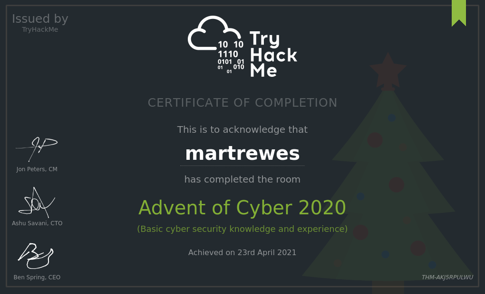

# Advent of ~~Code~~ Cyber 2020 Log

In this repository is just a log I decided to keep whilst doing the Advent of Cyber room on TryHackMe *(I know I'm far too late)*. It is my first attempt at doing anything at all like this, but I thought it would be a good introduction into pentesting and forensics as that has always been an interest of mine. 

I will attempt to do one a day, however due to the event ending a while ago, I do not feel I am rushed for time. I may complete it sooner, who knows?

---
# Complete

I ended up completing this in my own time as well as completing tasks in picoCTF, hence the lack of write-ups. Below is the certificate as *proof*:

